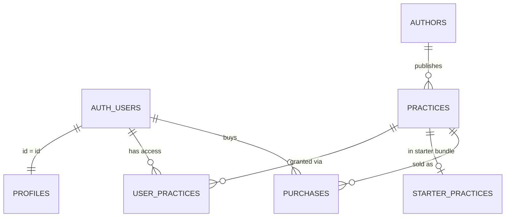

# DATABASE_SCHEMA.md — фактическая схема базы «АудиоЛад»

Документ фиксирует **фактическое состояние** рабочей self-hosted Supabase-базы на момент составления (2026-07-12). База данных, миграции, RLS и код приложения **не изменялись** при подготовке этого файла.

---

## 1. Источники схемы

| Источник | Что использовано | Ограничения |
|----------|------------------|-------------|
| SQL-миграции репозитория | `supabase/migrations/*.sql` (6 файлов) | Содержат DDL только для `user_practices`, `starter_practices`, функций grant/signup, bucket `practice-audio`. Ссылаются на `practices` и `profiles` как на уже существующие объекты. |
| Типы базы данных | Поиск по репозиторию | Сгенерированных TypeScript-типов Supabase (`database.types.ts`) **нет**. Типы в коде — локальные `type` в page-компонентах. |
| Запросы приложения | `src/app/catalog/page.tsx`, `practice/[slug]/page.tsx`, `listen/[slug]/page.tsx`, `my-practices/page.tsx`, `profile/*`, `settings/page.tsx` | Отражают ожидаемые поля и связи, но не гарантируют полноту схемы. |
| Рабочая PostgreSQL-база | `docker exec supabase-db psql` — `information_schema`, `pg_constraint`, `pg_policies`, `pg_indexes`, `pg_proc`, `information_schema.triggers` | Основной источник истины для полей, ключей, RLS и функций. Секреты и строки подключения **не выводились**. |
| Supabase Storage | `storage.buckets`, `storage.objects`, политики `storage.objects` | Подтверждены bucket и entitlement-aware SELECT policy. |
| Существующая документация | `docs/DATABASE.md`, `AUDIOLAD_TECHNICAL_AUDIT.md`, `docs/ARCHITECTURE.md`, `docs/PROJECT_STATE.md` | Частичные описания `profiles` и `practices`; использованы для сверки, при расхождении приоритет у live DB. |

**Не использовались:** значения `.env.local`, service role key, пароли, полные connection strings.

---

## 2. Список таблиц (`public`)

В рабочей базе обнаружено **6 пользовательских таблиц** в схеме `public`.

| Таблица | Назначение | DDL в Git | Используется в коде | Примечание |
| ------- | ---------- | --------: | ------------------: | ---------- |
| `authors` | Автор / авторский бренд контента | ❌ | ⚠️ Частично | Nested select из `practices`; статичные страницы `/authors/*` не читают таблицу |
| `practices` | Карточка аудиопрактики (метаданные, цена, путь к аудио) | ❌ | ✅ | Каталог, страница практики, прослушивание, библиотека |
| `profiles` | Профиль платформенного пользователя | ❌ | ✅ | `/profile`, `/profile/edit`, `/settings` |
| `user_practices` | Права доступа / личная библиотека (entitlement) | ✅ | ✅ | `/my-practices`, `/listen/[slug]`, `/practice/[slug]` |
| `starter_practices` | Конфигурация стартового набора практик | ✅ | ❌ | Только SQL-функции и миграции данных |
| `purchases` | История платежей (задел) | ❌ | ❌ | Таблица есть в БД; UI `/purchases` — демо-данные |

### Системные сущности (приложение обращается косвенно)

| Сущность | Назначение | Прямое использование в коде |
| -------- | ---------- | --------------------------- |
| `auth.users` | Учётные записи Supabase Auth | Через `supabase.auth.*`; FK из `profiles`, `user_practices` |
| `storage.buckets` / `storage.objects` | Private-хранилище аудио | `supabase.storage.from("practice-audio")` на `/listen/[slug]` |

---

## 3. Подробное описание таблиц

### `public.authors`

Каталог авторов контента. **Не связана** с `profiles` или `auth.users`.

#### Поля

| Поле | Тип | Nullable | Default | Назначение |
| ---- | --- | -------: | ------- | ---------- |
| `id` | `uuid` | NO | `gen_random_uuid()` | Первичный ключ |
| `name` | `text` | NO | — | Отображаемое имя автора |
| `slug` | `text` | NO | — | URL-slug (`sergey-and-zoya`) |
| `description` | `text` | YES | — | Описание автора |
| `avatar_url` | `text` | YES | — | URL аватара |
| `created_at` | `timestamptz` | YES | `now()` | Дата создания |

#### Ключи и ограничения

- **PK:** `id`
- **UNIQUE:** `slug` (`authors_slug_key`)
- **FK:** нет исходящих и входящих связей с пользователями
- **CHECK:** только NOT NULL на обязательных полях
- **Индексы:** `authors_pkey`, `authors_slug_key`

#### Связи

```text
practices.author_id → authors.id (ON DELETE SET NULL)
```

#### RLS

| Параметр | Значение |
|----------|----------|
| RLS включён | ✅ |
| Политики | `Public can read authors` — **SELECT**, роль `{public}`, условие `true` |
| INSERT / UPDATE / DELETE | Политик **нет** → операции запрещены для `anon` / `authenticated` |
| Риск | На уровне GRANT роли `anon` и `authenticated` имеют широкие привилегии на таблицу; фактический доступ к записи ограничен RLS. При отключении RLS таблица станет полностью доступной на запись. |

#### Использование в коде

- `src/app/practice/[slug]/page.tsx` — nested `authors (id, name, slug, description, avatar_url)`
- `src/app/listen/[slug]/page.tsx` — nested `authors (id, name, slug)`
- `src/app/my-practices/page.tsx` — nested `authors (id, name, slug, avatar_url)`
- Статичные маршруты `src/app/authors/*` — **не** читают таблицу

#### Документирование

- `docs/DATABASE.md` — не описана
- `AUDIOLAD_TECHNICAL_AUDIT.md` — частично (inferred)

---

### `public.practices`

Карточка аудиопрактики: метаданные, цена, статус публикации, путь к файлу в Storage.

#### Поля

| Поле | Тип | Nullable | Default | Назначение |
| ---- | --- | -------: | ------- | ---------- |
| `id` | `uuid` | NO | `gen_random_uuid()` | Первичный ключ |
| `author_id` | `uuid` | YES | — | Связь с автором |
| `title` | `text` | NO | — | Название |
| `slug` | `text` | NO | — | URL-slug (уникальный) |
| `description` | `text` | YES | — | Описание |
| `format` | `text` | YES | — | Формат (медитация, практика и т.д.) |
| `duration_minutes` | `integer` | YES | — | Длительность в минутах |
| `price` | `integer` | YES | `0` | Цена в рублях (целое число) |
| `is_free` | `boolean` | YES | `false` | Флаг бесплатности |
| `cover_url` | `text` | YES | — | Обложка (в БД сейчас не заполнена ни у одной практики) |
| `audio_url` | `text` | YES | — | **Относительный путь** в bucket `practice-audio`, не публичный URL |
| `status` | `text` | YES | `'published'` | Статус публикации |
| `created_at` | `timestamptz` | YES | `now()` | Дата создания; сортировка каталога |

#### Ключи и ограничения

- **PK:** `id`
- **UNIQUE:** `slug` (`practices_slug_key`)
- **FK:** `author_id` → `authors(id)` ON DELETE SET NULL
- **CHECK:** явных CHECK на `status`, `price`, `is_free` **нет** (только NOT NULL)
- **Индексы:** `practices_pkey`, `practices_slug_key` (индекса на `author_id` нет)

#### Связи

```text
practices.author_id → authors.id
user_practices.practice_id → practices.id
starter_practices.practice_id → practices.id
purchases.practice_id → practices.id
```

#### RLS

| Параметр | Значение |
|----------|----------|
| RLS включён | ✅ |
| Политики | `Public can read published practices` — **SELECT**, роль `{public}`, условие `status = 'published'` |
| INSERT / UPDATE / DELETE | Политик **нет** |
| Риск | Аналогично `authors`: широкие GRANT + RLS только на SELECT опубликованных. Неопубликованные практики клиентом прочитать нельзя. |

#### Фактические данные (контекст, не секреты)

- Записей: **5**, все со `status = 'published'`
- Стартовый набор (3 slug): `elixir-molodosti`, `klyuch-k-izobiliyu`, `kod-prityazheniya` — `is_free = true`, `price = 0`
- Аудио загружено только для `elixir-molodosti`: путь вида `practices/{practice_uuid}/audio.mp3`

#### Использование в коде

| Файл | Поля / поведение |
|------|------------------|
| `src/app/catalog/page.tsx` | REST: `id, title, slug, description, format, duration_minutes, price, is_free, status`; фильтр `published`; `order=created_at.desc` |
| `src/app/practice/[slug]/page.tsx` | Полный набор + nested `authors`; проверка entitlement |
| `src/app/listen/[slug]/page.tsx` | Метаданные + `audio_url`; валидация пути `practices/{id}/...` |
| `src/app/my-practices/page.tsx` | Через join из `user_practices` |

#### Документирование

- `docs/DATABASE.md` — частично (без `author_id`, `cover_url`, `audio_url`)
- Миграции — только **ссылки** на таблицу, без CREATE

---

### `public.profiles`

Профиль слушателя платформы. Постоянный идентификатор совпадает с Auth.

#### Поля

| Поле | Тип | Nullable | Default | Назначение |
| ---- | --- | -------: | ------- | ---------- |
| `id` | `uuid` | NO | — | PK = `auth.users.id` |
| `email` | `text` | YES | — | Копия email из Auth |
| `full_name` | `text` | YES | — | Отображаемое имя (заполняется вручную через edit) |
| `role` | `text` | NO | `'listener'` | Роль пользователя |
| `created_at` | `timestamptz` | YES | `now()` | Дата создания |

#### Ключи и ограничения

- **PK:** `id`
- **FK:** `id` → `auth.users(id)` ON DELETE CASCADE
- **UNIQUE:** только PK
- **Индексы:** `profiles_pkey`

#### Связи

```text
profiles.id → auth.users.id (1:1)
```

Связи `profiles` ↔ `authors` **нет**.

#### RLS

| Политика | Операция | Условие |
|----------|----------|---------|
| `Users can view own profile` | SELECT | `auth.uid() = id` |
| `Users can insert own profile` | INSERT | `WITH CHECK (auth.uid() = id)` |
| `Users can update own profile` | UPDATE | `USING (auth.uid() = id)` |
| DELETE | — | Политики **нет** |

#### Использование в коде

- `src/app/profile/page.tsx` — `select("full_name")`
- `src/app/profile/edit/actions.ts` — `update({ full_name })`
- `src/app/settings/page.tsx` — `select` с `full_name`, `role`

#### Документирование

- `docs/DATABASE.md` — описана частично ✅

---

### `public.user_practices`

Таблица **прав доступа** (entitlement) и одновременно источник **личной библиотеки** `/my-practices`. Отделена от финансовых покупок.

#### Поля

| Поле | Тип | Nullable | Default | Назначение |
| ---- | --- | -------: | ------- | ---------- |
| `id` | `uuid` | NO | `gen_random_uuid()` | PK записи доступа |
| `user_id` | `uuid` | NO | — | Пользователь (`auth.users.id`) |
| `practice_id` | `uuid` | NO | — | Практика |
| `access_source` | `text` | NO | — | Источник доступа |
| `granted_at` | `timestamptz` | NO | `now()` | Когда выдан доступ |
| `expires_at` | `timestamptz` | YES | — | Срок действия; `NULL` = бессрочно |
| `metadata` | `jsonb` | NO | `'{}'` | Произвольные метаданные grant |
| `created_at` | `timestamptz` | NO | `now()` | Техническая метка создания строки |

#### Ключи и ограничения

- **PK:** `id`
- **UNIQUE:** `(user_id, practice_id)` — повторная выдача идемпотентна через `ON CONFLICT DO NOTHING`
- **FK:** `user_id` → `auth.users(id)` ON DELETE CASCADE; `practice_id` → `practices(id)` ON DELETE CASCADE
- **CHECK `access_source`:** `starter`, `free_claim`, `purchase`, `gift`, `subscription`, `program`, `admin`
- **CHECK `expires_at`:** `expires_at IS NULL OR expires_at > granted_at`
- **Индексы:** `(user_id, granted_at DESC)`, `(practice_id)`, unique `(user_id, practice_id)`

#### Связи

```text
user_practices.user_id → auth.users.id
user_practices.practice_id → practices.id
```

#### RLS

| Политика | Операция | Условие |
|----------|----------|---------|
| `Users can view own library` | SELECT | `auth.uid() = user_id` |
| INSERT / UPDATE / DELETE | — | Политик **нет** для клиента |

**GRANT:** `authenticated` имеет только `SELECT`. INSERT выполняется через `SECURITY DEFINER` функции (`grant_active_starter_practices`, `handle_new_user`).

#### Использование в коде

- `src/app/my-practices/page.tsx` — список библиотеки с join на `practices`
- `src/app/listen/[slug]/page.tsx` — проверка доступа перед signed URL
- `src/app/practice/[slug]/page.tsx` — badge источника доступа для авторизованных

#### Миграция

- `supabase/migrations/20260710115506_create_user_library.sql`

---

### `public.starter_practices`

Платформенная конфигурация стартового набора (сейчас 3 активные практики).

#### Поля

| Поле | Тип | Nullable | Default | Назначение |
| ---- | --- | -------: | ------- | ---------- |
| `practice_id` | `uuid` | NO | — | PK + FK на практику |
| `sort_order` | `integer` | NO | — | Порядок в наборе (уникальный, > 0) |
| `is_active` | `boolean` | NO | `true` | Включена ли в выдачу при регистрации |
| `created_at` | `timestamptz` | NO | `now()` | Дата добавления в набор |

#### Ключи и ограничения

- **PK:** `practice_id`
- **UNIQUE:** `sort_order`
- **FK:** `practice_id` → `practices(id)` ON DELETE CASCADE
- **CHECK:** `sort_order > 0`
- **Индекс:** `starter_practices_active_sort_idx` WHERE `is_active = true`
- **Триггер:** `validate_starter_practice_before_write` — практика должна быть `published` и `is_free = true`

#### RLS

| Параметр | Значение |
|----------|----------|
| RLS включён | ✅ |
| Политики | **Нет** |
| Доступ клиента | Полный запрет для `anon` / `authenticated` (нет GRANT) |
| Доступ | Только `service_role` и SECURITY DEFINER функции |

#### Миграции

- DDL: `20260710115506_create_user_library.sql`
- Данные: `20260710122053_configure_starter_practices.sql` (ожидает 3 конкретных slug в `practices`)

---

### `public.purchases`

Задел под историю платежей. **Не используется** приложением.

#### Поля

| Поле | Тип | Nullable | Default | Назначение |
| ---- | --- | -------: | ------- | ---------- |
| `id` | `uuid` | NO | `gen_random_uuid()` | PK |
| `user_id` | `uuid` | NO | — | Покупатель |
| `practice_id` | `uuid` | YES | — | Купленная практика |
| `amount` | `integer` | NO | — | Сумма |
| `status` | `text` | YES | `'paid'` | Статус платежа |
| `created_at` | `timestamptz` | YES | `now()` | Дата покупки |

#### Ключи и ограничения

- **PK:** `id`
- **FK:** `practice_id` → `practices(id)` ON DELETE CASCADE
- **FK на `user_id` → auth.users:** **отсутствует** в рабочей БД
- **CHECK:** нет явных ограничений на `status`
- **Индексы:** только PK

#### RLS

| Политика | Операция | Условие |
|----------|----------|---------|
| `Users can view own purchases` | SELECT | `auth.uid() = user_id` |
| INSERT / UPDATE / DELETE | — | Политик **нет** |

Записей в таблице: **0**.

---

## 4. Таблицы `authors` и `practices` — расширенный разбор

### `authors`

| Вопрос | Факт |
|--------|------|
| Все поля | `id`, `name`, `slug`, `description`, `avatar_url`, `created_at` |
| Связь с пользователем | **Нет.** Колонки `user_id`, `profile_id` отсутствуют |
| Автор без пользователя | **Да.** В БД 1 автор (`Сергей и Зоя`), ни одна практика без `author_id` |
| Несколько авторов на пользователя | **Неприменимо** — связи с `profiles` нет |
| Один автор — много практик | **Да** — все 5 практик ссылаются на одного автора |
| DDL в Git | **Отсутствует** |
| RLS | Только публичное чтение всех авторов |

### `practices`

| Аспект | Факт |
|--------|------|
| Связь с автором | `author_id` (nullable FK → `authors.id`, ON DELETE SET NULL) |
| Название / slug / описание | `title`, `slug` (UNIQUE), `description` |
| Изображение | `cover_url` — ожидается кодом, в БД пока пусто |
| Аудио | `audio_url` — относительный путь в private bucket; формат `practices/{uuid}/audio.mp3` |
| Цена | `price` (integer, default 0) + `is_free` (boolean) |
| Статус публикации | `status` (text, default `'published'`); в данных только `'published'` |
| Тип доступа | Отдельного поля **нет**; доступ вычисляется через `user_practices`, не через поля практики |
| Порядок сортировки | В каталоге: `created_at DESC`; в starter bundle: `starter_practices.sort_order` |
| Уникальность | `slug` UNIQUE |
| RLS | SELECT только `status = 'published'` |

### Поля, которые код ожидает, но которых нет в миграциях репозитория

Код и live DB согласованы между собой; расхождение — **код/БД ↔ Git**:

| Поле / связь | Где ожидается | В миграциях Git |
|--------------|---------------|-----------------|
| Вся таблица `practices` | catalog, practice, listen, my-practices, миграции library | ❌ |
| `practices.author_id` | PostgREST nested `authors` | ❌ |
| `cover_url`, `audio_url` | practice, my-practices, listen | ❌ |
| `created_at` | catalog sort | ❌ |
| Вся таблица `authors` | nested select | ❌ |
| `authors.description`, `avatar_url` | practice, my-practices | ❌ |
| RLS `Public can read published practices` | REST catalog | ❌ |
| RLS `Public can read authors` | nested select | ❌ |

---

## 5. Auth и профиль пользователя

### Постоянный `user_id`

```text
auth.users.id  —  канонический идентификатор пользователя (UUID)
profiles.id    —  совпадает с auth.users.id (1:1)
user_practices.user_id — ссылается на auth.users.id
```

Email **не** является первичным бизнес-идентификатором; дублируется в `profiles.email` для удобства.

### Триггер регистрации

| Объект | Расположение DDL в Git | Факт в рабочей БД |
|--------|------------------------|-------------------|
| Триггер `on_auth_user_created` | **CREATE отсутствует** (миграция только проверяет наличие) | `AFTER INSERT ON auth.users` → `handle_new_user()` |
| Функция `handle_new_user()` | `20260710125301_grant_starter_practices_on_signup.sql` (REPLACE) | SECURITY DEFINER; contract marker `audiolad:new-user:v1` |
| Функция `grant_active_starter_practices(uuid)` | `20260710115506` + `20260710123518` | SECURITY DEFINER; contract marker `audiolad:starter-grant:v1` |

### Что происходит при регистрации нового пользователя

1. Supabase Auth создаёт запись в `auth.users`.
2. Триггер `on_auth_user_created` вызывает `handle_new_user()`.
3. `handle_new_user()`:
   - проверяет контракт функции `grant_active_starter_practices`;
   - вставляет `profiles (id, email, role='listener')`;
   - вызывает `grant_active_starter_practices(NEW.id)` → строки в `user_practices` с `access_source = 'starter'` для активных starter-практик.
4. `full_name` **не** копируется из `user_metadata` в `profiles` автоматически.

### Риск отсутствия профиля

| Сценарий | Риск |
|----------|------|
| Сбой между INSERT в `auth.users` и `handle_new_user` | Пользователь без `profiles` и без starter library; транзакция триггера обычно атомарна в рамках одного INSERT |
| Ручное удаление `profiles` | Auth-сессия сохранится, но profile-страницы вернут пустые данные / fallback на metadata |
| Повторный INSERT профиля | Заблокирован PK; приложение имеет INSERT policy only for own id |

Текущее состояние: `auth.users` = 7, `profiles` = 7 (полное соответствие).

---

## 6. Entitlement и библиотека

### Таблица прав доступа

**Название:** `public.user_practices` (не `user_entitlements`).

### Как проверяется доступ к практике

1. `/listen/[slug]`: после auth запрос `user_practices` по `practice_id` (RLS ограничивает `user_id = auth.uid()`).
2. Проверка `expires_at IS NULL OR expires_at > now()` — в коде (`isAccessActive`) и в Storage RLS.
3. `/practice/[slug]`: аналогичная проверка для отображения badge доступа.
4. Storage: политика на `storage.objects` дублирует проверку entitlement по `practice_id` из пути объекта.

### Как материал попадает в `/my-practices`

- Прямой SELECT из `user_practices` с join `practices` + `authors`.
- Отдельной таблицы «библиотека» **нет** — библиотека = активные строки `user_practices`.
- Фильтрация истёкших доступов — в коде (`mapActiveLibraryItems`).

### Повторная выдача и отзыв

| Операция | Поддержка |
|----------|-----------|
| Повторная выдача | Идемпотентна: UNIQUE `(user_id, practice_id)` + `ON CONFLICT DO NOTHING` |
| Отзыв доступа | DELETE/UPDATE через клиент **невозможны** (нет политик); только service role / SQL |
| Срок действия | Поле `expires_at`; при истечении доступ блокируется в коде и Storage RLS |

### Связь с покупками

- `purchases` существует, но pipeline «оплата → grant» **не реализован**.
- `access_source = 'purchase'` предусмотрен CHECK-ом, но в данных только `'starter'`.

---

## 7. Схема связей (Mermaid)



---

## 8. Расхождения между рабочей базой и Git

| Объект | Есть в рабочей БД | Есть в миграциях | Используется кодом | Риск |
| ------ | ----------------: | ---------------: | -----------------: | ---- |
| Таблица `authors` | ✅ | ❌ | ⚠️ | **Критический** — невосстановима из Git |
| Таблица `practices` | ✅ | ❌ (только FK-ссылки) | ✅ | **Критический** — блокирует применение library-миграций на пустой БД |
| Таблица `profiles` | ✅ | ❌ | ✅ | **Критический** — регистрация сломана без ручного DDL |
| Таблица `purchases` | ✅ | ❌ | ❌ | **Средний** — «призрачная» схема, нет FK на `user_id` |
| RLS `authors`, `practices`, `profiles`, `purchases` | ✅ | ❌ | ✅ | **Высокий** — политики не воспроизводятся |
| Триггер `on_auth_user_created` | ✅ | ❌ (только ASSERT) | ✅ | **Критический** — signup не выдаст профиль и library |
| `user_practices` | ✅ | ✅ | ✅ | Низкий |
| `starter_practices` | ✅ | ✅ | ❌ | Низкий |
| `grant_active_starter_practices` | ✅ | ✅ | ❌ | Низкий |
| `handle_new_user` | ✅ | ✅ (REPLACE) | ❌ | Средний — нужен pre-existing trigger |
| `validate_starter_practice` | ✅ | ✅ | ❌ | Низкий |
| Bucket `practice-audio` + Storage RLS | ✅ | ✅ | ✅ | Низкий |
| Миграция `configure_starter_practices` | N/A (данные) | ✅ | ❌ | **Высокий** — упадёт без 3 конкретных slug |
| Миграция `backfill_starter_practices` | N/A (данные) | ✅ | ❌ | **Высокий** — упадёт без пользователей и starter config |
| `validate_starter_practice` vs `grant_*` | trigger не проверяет `price = 0` | grant проверяет | — | Низкий — несогласованность валидации |
| Широкие GRANT на `authors`/`practices` | ✅ | ❌ | — | Средний — опасно при случайном отключении RLS |

### Код, ожидающий объекты вне миграций

Все production-запросы к `practices`, `authors`, `profiles` предполагают объекты, созданные вне репозитория. Миграции `20260710115506` и последующие **не могут быть первыми** на чистой базе.

---

## 9. Риск восстановления проекта

### Ответ: **нет**

Развернуть пустую базу **только** из файлов репозитория и получить схему, совместимую с приложением, **сейчас нельзя**.

#### Чего не хватает

1. **DDL `authors`, `practices`, `profiles`, `purchases`** — CREATE TABLE, индексы, FK, GRANT.
2. **RLS-политики** для четырёх таблиц выше.
3. **CREATE TRIGGER `on_auth_user_created`** на `auth.users` (миграция лишь проверяет его наличие).
4. **Начальные данные** — автор, практики, starter bundle (миграции данных завязаны на конкретные slug).
5. **Согласованность миграций** — первая library-миграция сразу ссылается на `public.practices`, которой нет в репозитории.

#### Что восстановится частично

- `user_practices`, `starter_practices`, функции grant/validate, `handle_new_user` (как REPLACE), bucket `practice-audio` — **при условии**, что prerequisite-таблицы уже созданы вручную.

---

## 10. План безопасного восстановления DDL (предложение, не к выполнению)

### 1. Объекты для экспорта из рабочей БД

Порядок экспорта schema-only (без данных):

1. `public.authors`
2. `public.practices` (+ FK на authors)
3. `public.profiles` (+ FK на auth.users)
4. `public.purchases` (решить: включать или пометить deprecated)
5. RLS policies и GRANT/REVOKE для п.1–4
6. `CREATE TRIGGER on_auth_user_created` на `auth.users`
7. Сверка с существующими миграциями: `user_practices`, `starter_practices`, функции, storage

### 2. Порядок применения на тестовой пустой базе

```text
auth.users (Supabase base)
  → authors
  → practices
  → profiles + trigger on_auth_user_created + handle_new_user
  → user_practices + starter_practices + functions (существующие миграции)
  → storage bucket + policy
  → seed data (authors, practices, starter_practices rows)
  → data backfill migrations (только если нужны)
```

### 3. Зависимости

- Все FK на `practices` требуют предварительного CREATE `practices`.
- `handle_new_user` требует `profiles`, `user_practices`, `starter_practices`, `grant_active_starter_practices`.
- Storage policy ссылается на `user_practices` и `practices`.
- Starter data migrations требуют 3 опубликованных бесплатных практик с фиксированными slug.

### 4. Как не затронуть production-данные

- Экспорт только `pg_dump --schema-only` в отдельный файл baseline.
- На production baseline-миграцию **не применять повторно** — использовать таблицу учёта миграций Supabase с пометкой «baseline applied manually» или одноразовый `baseline_*` файл с `IF NOT EXISTS`.
- Данные (seed/backfill) выносить в отдельные reversible/data-миграции.

### 5. Проверка на пустой тестовой базе

1. Поднять чистый Supabase stack.
2. Применить baseline DDL + существующие 6 миграций по порядку.
3. Загрузить минимальный seed (1 author, 3 starter practices).
4. Зарегистрировать тестового пользователя → проверить `profiles` + 3 строки `user_practices`.
5. Прогнать `npm run build` и сценарии `/catalog`, `/practice/{slug}`, `/listen/{slug}`, `/my-practices`.

### 6. Защита от повторного применения к production

- Baseline-файл с явным заголовком `BASELINE — DO NOT RE-RUN ON PRODUCTION`.
- В `supabase_migrations.schema_migrations` зафиксировать checksum baseline как уже применённый.
- CI-check: сравнение `pg_dump --schema-only` тестовой базы после полного прогона с live schema (minus data).

---

## Приложение: функции и триггеры

| Объект | Тип | DDL в Git | Назначение |
|--------|-----|-----------|------------|
| `grant_active_starter_practices(uuid)` | FUNCTION, SECURITY DEFINER | ✅ | Идемпотентная выдача starter library |
| `handle_new_user()` | FUNCTION, SECURITY DEFINER | ✅ (REPLACE) | Профиль + starter grant при signup |
| `validate_starter_practice()` | FUNCTION, SECURITY DEFINER | ✅ | Валидация starter config |
| `on_auth_user_created` | TRIGGER on `auth.users` | ❌ | Вызов `handle_new_user()` |
| `validate_starter_practice_before_write` | TRIGGER on `starter_practices` | ✅ | BEFORE INSERT/UPDATE |

## Приложение: Storage

| Параметр | Значение |
|----------|----------|
| Bucket | `practice-audio` |
| Public | `false` |
| Max size | 104 857 600 bytes (100 MiB) |
| MIME | `audio/mpeg` |
| Path convention | `practices/{practice_id}/audio.mp3` |
| Policy | `Authenticated users can read entitled practice audio` (SELECT, role `authenticated`) |
| Объектов в bucket | 1 (на момент аудита) |

---

*Документ подготовлен для устранения архитектурного риска «схема живёт только в production». Следующий шаг — согласованный baseline DDL в репозитории (отдельное задание).*
